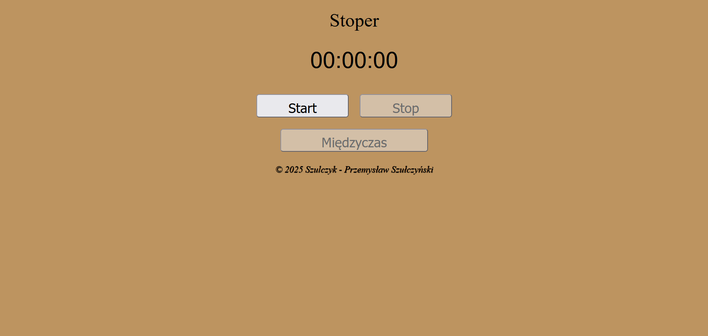
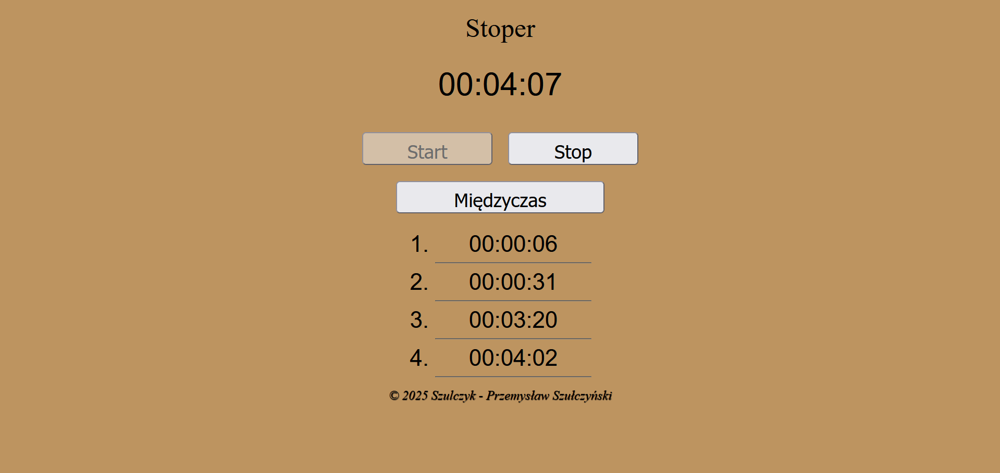
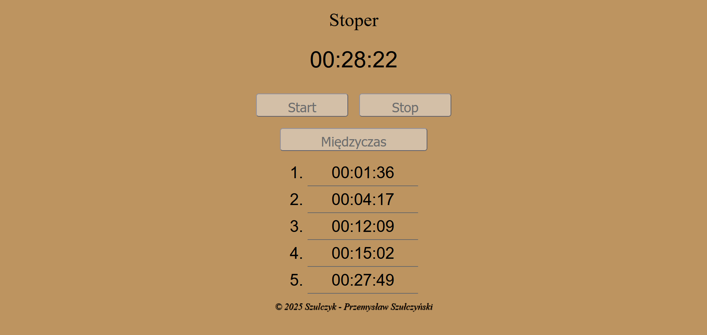
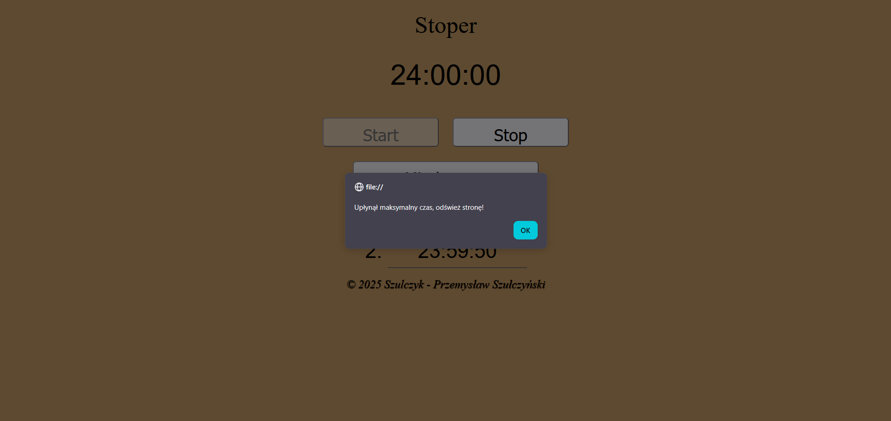

# ***[Projekt Stoper](https://szulczyk.pl/projekt-10/stoper)***

## 🖼️ ***Zrzuty ekranu***

 

## 📄 ***Opis projektu***
### ✅ *Projekt zakończony dnia 19.02.2025*
### *Projekt umożliwia precyzyjne mierzenie i zapisywanie czasu. Dzięki trzem przyciskom (start, stop, międzyczas) użytkownik może łatwo rejestrować wybrane odcinki czasowe. Dodatkowo aplikacja posiada automatyczny wyłącznik, który zatrzymuje pomiar po osiągnięciu 24 godzin.*

 

## 🛠️ ***Stack projektu***
- ### *Frontend*
  - ### *HTML5*
  - ### *CSS3*
  - ### *JavaScript*
- ### *Backend*
  - ### *Brak użytych technologii*
- ### *Bazy danych*
  - ### *Brak użytych technologii*

 

## 📌 ***Podsumowanie projektu***
### 🎯 *Tworząc ten stoper, miałem okazję przećwiczyć zarządzanie funkcjami czasowymi oraz dodawanie dynamicznych elementów na stronie. Efektem tych prac jest prosta w obsłudze aplikacja, która precyzyjnie mierzy czas, pozwala zapisywać wybrane momenty i automatycznie wyłącza się po 24 godzinach.*
### 💡 *Czego się nauczyłem:*
- ### *Czysty design bez grafik - zaprojektowałem minimalistyczny i ładny interfejs, opierając się tylko na czystym kodzie, bez użycia obrazków.*
- ### *Dynamiczne dodawanie elementów - przećwiczyłem tworzenie i wrzucanie nowych elementów wraz z ich atrybutami prosto na stronę.*
- ### *Kontrola nad czasem - przećwiczyłem poprawne uruchamianie, resetowanie i czyszczenie liczników, co pozwoliło mi na pełną kontrolę nad działaniem stopera.*
- ### *Praca pod presją czasu - nauczyłem się, jak szybko przechodzić od pomysłu do gotowego kodu i zamknąć cały projekt w jak najkrótszym czasie.*
- ### *Kod bez lagów - wykombinowałem, jak sprytnie poukładać całą logikę, żeby stoper startował natychmiast po kliknięciu i odmierzał czas z idealną precyzją, bez żadnych opóźnień.*

 

## 📨 ***Kontakt***
- ### 📧 *E-mail -* przemo.ppk@gmail.com
- ### 💻 *Discord -* darkcoder97